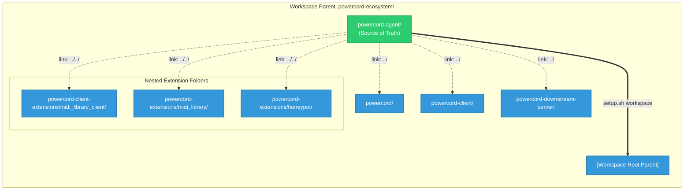

# Powercord Agent Guidelines & Guardrails

This repository houses the centralized agent instructions, custom skills, and execution workflows for the **Powercord Ecosystem** (Core backend server, desktop client app, server-side cogs, and companion client-side extensions).

Centralizing these files in this repository prevents duplication and ensures that all agent interactions across the different projects remain normalized and secure.

---

## Workspace Visualization

Here is the simplified folder hierarchy of the multi-repository Powercord ecosystem and how the setup script symlinks `.cursorrules` and `.agent/` from `powercord-agent` (the Source of Truth) to the rest of the workspace:



---

## Repository Contents

* **`.cursorrules`**: The global custom guardrails for AI coding assistants. Covers agent behaviors, communication norms, Git workflow rules, environment safety configurations, and architectural split-stack design principles.
* **`.agent/`**: 
  * **`skills/`**: Customized domain-specific knowledge bases and scripts (e.g. `powercord-ecosystem` for core and extensions, `powercord-gcp-operations` for VMs).
  * **`workflows/`**: Step-by-step procedures for deployment and testing (e.g. `fresh-install-downstream-server.md` and client equivalents).

---

## Integration Patterns

Because the Powercord workspace consists of multiple repositories instead of a single monorepo, we support two design patterns for sharing agent rules:

### Pattern A: Workspace Root Integration (Recommended for Monorepo-like Workspaces)
This pattern is ideal if you open the entire parent folder (`powercord-ecosystem/`) as a single workspace in your IDE (Cursor, VS Code, etc.). 
* Links `.cursorrules` and `.agent` directly to the parent folder.
* **Command**:
  ```bash
  ./setup.sh workspace
  ```

### Pattern B: Individual Sub-Repository Integration (Recommended for Isolated Projects)
This pattern is ideal if you open each sub-repository (e.g., just `powercord/` or just `powercord-client/`) as an independent project in your IDE.
* Links `.cursorrules` and `.agent` into each sub-repository root using relative paths (`../powercord-agent/`).
* **Command**:
  ```bash
  ./setup.sh repos
  ```

---

## Usage

To automatically create the required symlinks, run the setup script from the root of the `powercord-agent` directory or the parent workspace root:

```bash
# Link to BOTH workspace root and all sub-repositories (recommended)
./powercord-agent/setup.sh all

# Link only to workspace root
./powercord-agent/setup.sh workspace

# Link only to sub-repositories
./powercord-agent/setup.sh repos
```
