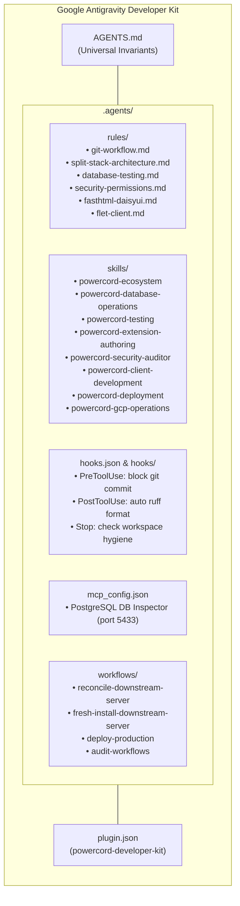

# Powercord Agent & Antigravity Developer Kit

This repository houses the centralized **Google Antigravity 2.0** customization architecture, custom skills, modular domain rules, and deterministic lifecycle hooks for the entire **Powercord Ecosystem** (Core backend server, companion desktop client, server cogs/sprockets, and companion client extensions).

---

## 1. Antigravity Architecture Overview


```mermaid
graph TD
    subgraph Antigravity ["Google Antigravity Developer Kit"]
        direction TB

        AGENTS["AGENTS.md<br/>(Universal Invariants)"]
        
        subgraph AgentsDir [".agents/"]
            RULES["rules/<br/>• git-workflow.md<br/>• split-stack-architecture.md<br/>• database-testing.md<br/>• security-permissions.md<br/>• fasthtml-daisyui.md<br/>• flet-client.md"]
            SKILLS["skills/<br/>• powercord-ecosystem<br/>• powercord-database-operations<br/>• powercord-testing<br/>• powercord-extension-authoring<br/>• powercord-security-auditor<br/>• powercord-client-development<br/>• powercord-deployment<br/>• powercord-gcp-operations"]
            HOOKS["hooks.json & hooks/<br/>• PreToolUse: block git commit<br/>• PostToolUse: auto ruff format<br/>• Stop: check workspace hygiene"]
            MCP["mcp_config.json<br/>• PostgreSQL DB Inspector (port 5433)"]
            WF["workflows/<br/>• reconcile-downstream-server<br/>• fresh-install-downstream-server<br/>• deploy-production<br/>• audit-workflows"]
        end

        PLUGIN["plugin.json<br/>(powercord-developer-kit)"]
    end

    AGENTS --- AgentsDir
    AgentsDir --- PLUGIN
```

---

## 2. Directory Layout & Customization Structure

* **`AGENTS.md`**: Universal workspace invariant guardrails:
  * Strict prohibition of autonomous `git commit` by AI agents.
  * No conversational apologies — state root causes and refine guardrails immediately.
  * Strict scratch script isolation; clean workspace before turn completion.
  * Pre-commit formatting (`poetry run ruff format`) and testing standards.
* **`.agents/rules/`**: Modular domain rules loaded hierarchically and contextually:
  * [`git-workflow.md`](.agents/rules/git-workflow.md): Branch status (`just -g status`), normalization, and downstream reconciliation protocols.
  * [`split-stack-architecture.md`](.agents/rules/split-stack-architecture.md): FastHTML routes vs FastAPI sprockets, widget prefixes (`admin_`, `guild_admin_`), and decoupled migrations.
  * [`database-testing.md`](.agents/rules/database-testing.md): PostgreSQL port 5433 management, `NullPool` fixtures, and teardown isolation.
  * [`security-permissions.md`](.agents/rules/security-permissions.md): Discord permission bitmasks (View Channel `1 << 10` gating), default-deny auth, and checksum caching.
  * [`fasthtml-daisyui.md`](.agents/rules/fasthtml-daisyui.md): DaisyUI card arguments, modal styling, SVG imports, and `__signature__` decorator preservation.
  * [`flet-client.md`](.agents/rules/flet-client.md): Flet v0.82+ async routing, HTTPX client encapsulation, and desktop UI testing.
* **`.agents/skills/`**: Domain knowledge packages using progressive disclosure (`references/` and encapsulated `scripts/`):
  * `powercord-ecosystem`: Core architecture, auth beforeware, devkit Justfile, and failure patterns.
  * `powercord-database-operations`: Schema design, Alembic migrations, and `scripts/check_tables.py`, `scripts/clear_pg_locks.py`.
  * `powercord-testing`: Mocking guidelines, Cloud Build CI/CD, and `scripts/kill_stale_tests.py`.
  * `powercord-extension-authoring`: `extension.json` manifest schemas and gadget specifications.
  * `powercord-security-auditor`: Discord RBAC auditor rule engine and active alert scoring.
  * `powercord-client-development`: Desktop Flet views, async routing, and client extensions.
  * `powercord-deployment`: Production Cloud Build pipelines and Terraform infrastructure.
  * `powercord-gcp-operations`: Production container introspection and CLI commands.
* **`.agents/hooks.json`**: Active lifecycle enforcement:
  * `PreToolUse`: Intercepts `run_command` to hard-block `git commit` and unconfirmed production deployments.
  * `PostToolUse`: Auto-formats modified `.py` files using Ruff upon edit.
  * `Stop`: Verifies no temporary scratch scripts were left in the workspace root.
* **`.agents/mcp_config.json`**: Model Context Protocol servers (PostgreSQL introspection).
* **`.agents/workflows/`**: Step-by-step playbooks triggered via slash commands (`/reconcile-downstream-server`, `/deploy-production`, etc.).

---

## 3. Sub-Repository Integration

Each sub-repository in the ecosystem contains a scoped `AGENTS.md` providing focused instructions for its domain:
* `powercord/AGENTS.md` — Core server framework and database rules.
* `powercord-client/AGENTS.md` — Companion desktop client guidelines.
* `powercord-extensions/AGENTS.md` — Server-side extension authoring invariants.
* `powercord-client-extensions/AGENTS.md` — Client companion extension guidelines.
* `powercord-downstream-server/AGENTS.md` — Downstream staging deployment rules.

---

## 4. Verification

Run the setup verification script to validate workspace health:
```bash
./powercord-agent/setup.sh
```
